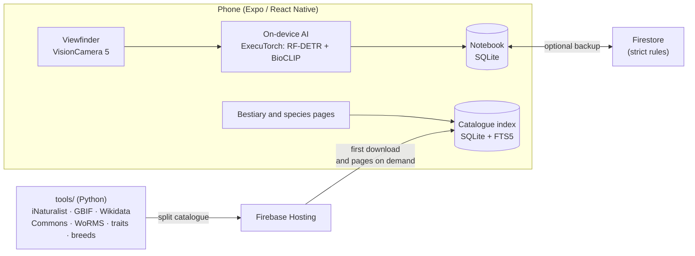

<div align="center">


# Zarpa

[Español](README.md) · **English**

Point your phone at an animal: the AI recognises the species **on the phone itself**
and your photo becomes a sticker in your field notebook.
More than 266,000 species from all over the world, every fact with its source.

[](https://github.com/Hredo/zarpa/actions/workflows/ci.yml)
[](https://github.com/Hredo/zarpa/releases)
[](LICENSE)
[](#installation)
[](https://docs.expo.dev/)

**[⬇ Download the Android APK](https://github.com/Hredo/zarpa/releases)**

<sub>The app's interface is in Spanish.</sub>

</div>

---

## Contents

- [What it is](#what-it-is)
- [What it does](#what-it-does)
- [Project status](#project-status)
- [**Installation**](#installation)
- [Privacy](#privacy)
- [If the app closes](#if-the-app-closes)
- [Development](#development) — [requirements](#requirements) · [getting started](#getting-started) · [checks](#checks) · [building the APK](#building-the-apk) · [catalogue and models](#catalogue-and-models-tools) · [Firebase](#firebase)
- [Architecture](#architecture)
- [How the AI decides](#how-the-ai-decides)
- [Data sources and licences](#data-sources-and-licences)
- [Contributing](#contributing)
- [Security](#security)
- [License](#license)

---

## What it is

Zarpa is a mobile app (Android; iOS on the way) for going out into the street, the
countryside or the coast and **spotting animals**. You point the camera, the phone's AI
says what it is and, if you log it, its die-cut sticker stays in your notebook with the
photo, the date, the place and the weather.

Three rules drive the whole project:

- **The whole world, every species.** The catalogue covers the animal species that people
  have photographed in the wild in any country, not a local subset.
- **Every fact, verified.** Each fact comes from the authority on it or from two sources
  that agree. Otherwise the species page leaves the gap instead of guessing.
- **The AI does not pretend.** It only names the species when its measured accuracy reaches
  95 %; otherwise it says how far it is sure (family, genus…) and lets you choose.

## What it does

| | |
|---|---|
| **AI viewfinder** | Live recognition on the phone (the photo is never sent to a server), with every lens and the full zoom range of your camera: ultra-wide, telephoto and the maximum digital zoom. |
| **Sticker notebook** | Each sighting is a sticker cut out from the background, with a holographic shine for rare ones. Journal, voice notes, weather and time of day. |
| **Bestiary** | Over 266,000 species with search, filters (group, diet, habitat, city, farm, threat…) and pages with free photos, sounds, tracks and plates, range and traits. |
| **Official breeds** | 8,417 breeds of dogs (FCI), cats (FIFe) and livestock (FAO DAD-IS and the Spanish Ministry of Agriculture). |
| **Atlas** | A map with GBIF observations, municipalities, forests, parks and protected areas, and what lives near you. |
| **Trips and challenges** | Trip mode, a calendar of what to see each month, weekly challenges, achievements, a daily quiz and alerts for rare species nearby. |
| **Social (optional)** | Google account, friends by code, a shared album and a cloud backup of the notebook. Without an account the whole app works. |
| **iNaturalist (optional)** | Send your sightings to iNaturalist so the community can confirm them. |

## Project status

**Beta.** Version 0.1.0 is the first public one.

- **Android 8 or later, 64-bit processor (arm64).** This is where the app is tested.
- **iOS 17 or later:** the code is ready, but Apple and Google sign-in still need to be set
  up and there is no build to install yet.
- Google sign-in only works in APKs signed with a key registered in the Firebase project
  (the ones in [Releases](https://github.com/Hredo/zarpa/releases) are). Everything else
  works in any build.

What is pending lives in [Issues](https://github.com/Hredo/zarpa/issues).

## Installation

### Android

1. On your phone, open the [Releases page](https://github.com/Hredo/zarpa/releases) and
   download the `.apk` of the latest version (about 250 MB: the AI is inside).
2. Open it. If Android says it does not allow apps from unknown sources, tap **Settings**
   and turn on **Allow from this source** for the browser or file manager you used.
3. Tap **Install**. If you already had an older version, it is updated and your notebook
   is kept.
4. The first time it starts, the app downloads the catalogue index (about 15-20 MB over the
   network). After that it works offline, except for what needs the internet: maps, photos
   of species pages you have not opened before, weather and the social features.

> [!NOTE]
> Test APKs are signed with a development key. When Zarpa reaches Google Play, this
> version will have to be uninstalled first, and uninstalling deletes the notebook on the
> phone. If you sign in, the cloud backup keeps the data of every sighting (photos, for now,
> only live on the phone).

**Verifying the download:** each release publishes the SHA-256 of the APK in its notes.
On Windows, `certutil -hashfile zarpa.apk SHA256`; on macOS or Linux, `shasum -a 256 zarpa.apk`.

### iOS

There is no build to install yet. To try it on your iPhone you can build it yourself (see
[Development](#development)) with Xcode and your developer account.

## Privacy

- **The AI runs on the phone.** Sighting photos never leave the phone to recognise the animal.
- **The notebook lives on the phone** (SQLite). The account is optional; if you use it, the
  cloud backup stores the data of each sighting in Firestore, behind rules that only let each
  person read and write their own data.
- **What the app asks third parties for:** the catalogue (Firebase Hosting), the photos and
  sounds of species pages (Wikimedia Commons and iNaturalist), maps (OpenFreeMap and GBIF),
  the weather (Open-Meteo, with the sighting's position) and, only if you connect it,
  iNaturalist.
- **No analytics, no ads.** The AI library's telemetry is switched off.
- Location is only used while the app is open, to know which species live where you are and
  to record where you saw each animal. Alerts about rare species never show where they were seen.

## If the app closes

If Zarpa closes because of an error, the next time you open it you will see what failed,
with a **Compartir el error** (*share the error*) button. Attach that text to a
[bug report](https://github.com/Hredo/zarpa/issues/new?template=fallo.yml): with it the
problem can be fixed without plugging the phone into a computer. The text only contains the
error, the version and the date: no photos, no location, no account data.

---

## Development

### Requirements

| Tool | Version | What for |
|---|---|---|
| [Node.js](https://nodejs.org/) | 22 | All the JavaScript |
| [pnpm](https://pnpm.io/) | 11 | Package manager. **The project only uses pnpm** (no npm, npx or yarn) |
| JDK | 17 or 21 | Building Android and running the Firebase emulators |
| [Android Studio](https://developer.android.com/studio) | recent | Android SDK and, if you want, a virtual device |
| Xcode | the one Expo SDK 57 asks for | iOS only (macOS) |
| Python + [uv](https://docs.astral.sh/uv/) | 3.13 | Only to regenerate the catalogue and models (`tools/`) |

A real Android phone with **USB debugging** enabled is the best way to test the camera and the AI.

### Getting started

```bash
git clone https://github.com/Hredo/zarpa.git
cd zarpa/app
pnpm install
```

**1. Configuration (optional).** Without it the whole app works, minus accounts and the cloud:

```bash
cp .env.example .env
```

Fill it in with the web configuration of **your** Firebase project (see
[docs/firebase.md](docs/firebase.md), in Spanish). They are public client identifiers, but
`.env` is never committed.

**2. AI models.** They are not in git (160 MB). Download them from the release into
`app/assets/models/`:

```bash
gh release download v0.1.0 --repo Hredo/zarpa --dir assets/models --pattern "bioclip_int8.pte" --pattern "species_index.bin"
```

Without the GitHub CLI, download them by hand from
[release v0.1.0](https://github.com/Hredo/zarpa/releases/tag/v0.1.0) into that folder.
They must match the `id` in `app/src/ai/modelAsset.ts`; if you regenerate the models with
`tools/`, that file is updated for you.

| File | SHA-256 |
|---|---|
| `bioclip_int8.pte` | `0bb59260ae040915f7c69ca231c8904f4925dbe5c162f69644f6dc4a018780ce` |
| `species_index.bin` | `894be623d4710eb2982ecf6a6c8280d54fb3ac7e249bb3ce027f7f5eaa7fa4fb` |

**3. Run it on a phone** (a development build: the app uses native modules that Expo Go
does not ship):

```bash
pnpm android
```

The first run generates the `android/` folder (not versioned: it comes from `app.json` and
the config plugins) and builds; it takes several minutes.

### Checks

Before opening a PR, all three must pass:

```bash
pnpm typecheck
pnpm lint
pnpm test
```

The tests that query the real catalogue (search, breeds, challenges, quiz) need
`tools/out/indice.db` and `tools/out/catalogo.db`. If you have not generated them, they are
skipped with a warning and the rest still run; CI does the same.

The Firestore and Storage rules have their own tests against the Firebase emulators (they
need Java):

```bash
cd firebase
pnpm install
pnpm test
```

### Building the APK

```bash
cd app
pnpm exec expo prebuild --platform android
cd android
./gradlew assembleRelease --max-workers=4
```

The APK ends up in `app/android/app/build/outputs/apk/release/app-release.apk`. Only
`arm64-v8a` is built. With many cores, the parallel native build can run out of memory;
`--max-workers=4` avoids it. If you change `app.json` or a config plugin, add `--clean` to
`prebuild`.

Without your own keystore, the release APK is signed with Android's debug key. To publish,
set up your keystore and [EAS Build](https://docs.expo.dev/build/introduction/)
(`pnpm dlx eas-cli@latest build`), and register its SHA-1 in Firebase if you use Google sign-in.

### Catalogue and models (`tools/`)

The catalogue and the models are generated with Python from open sources. Every request
goes through an HTTP cache (`tools/cache/http`): re-running a stage does not download again
what it already has.

```bash
cd tools
uv run python -m zarpa_data universe taxa wikidata gbif countries split commons wikipedia worms traits breeds urban depth size inat_names gbif_names photos wiki_images gbif_media obs_photos rank_names build hosting
```

| Stage | What it does |
|---|---|
| `universe`, `taxa` | Species with confirmed wild observations (iNaturalist) that also exist in the GBIF taxonomy |
| `wikidata`, `wikipedia`, `commons`, `*_names` | Common names, summaries, free photos, tracks and plates |
| `gbif`, `countries`, `split`, `urban`, `depth` | Which countries each species is seen in, whether it lives in cities, depth (cross-checked with WoRMS) |
| `worms`, `traits`, `size` | Environment (marine, freshwater, land), diet, activity, reproduction and size |
| `breeds` | Recognised breeds (FCI, FIFe, FAO DAD-IS, Spanish Ministry of Agriculture) |
| `build` | `tools/out/catalogo.db` |
| `hosting` | Splits the catalogue into `tools/out/hosting/` to be served from Firebase Hosting |

A full run takes hours (public APIs are rate limited) and several GB of cache. You do not
need it day to day: the app downloads the published catalogue.

The models (`tools/zarpa_models/`) use separate environments with PyTorch and ExecuTorch:
`export_pte.py` exports BioCLIP's image encoder to ExecuTorch (int8), `build_index.py`
builds the species index, `bench.py` and `evaluate.py` calibrate the thresholds and
`publish.py` copies everything to `app/assets/models/` and writes `app/src/ai/modelAsset.ts`.

### Firebase

Zarpa runs on the **free (Spark) plan**: Authentication, Firestore and Hosting, without
Cloud Functions. The rules (`firestore.rules`, `storage.rules`) are the only line of defence
and each one has its test. Project, deployment and data model: [docs/firebase.md](docs/firebase.md).
Friends and shared album: [docs/social.md](docs/social.md).

---

## Architecture



| Path | What lives there |
|---|---|
| `app/src/app/` | Screens (Expo Router: every file is a route) |
| `app/src/ai/` | Recognition engine, calibrated thresholds, camera and zoom selection |
| `app/src/db/` | Catalogue (local index + pages from Hosting) and Bestiary queries |
| `app/src/lib/` | Capture, stickers, location, weather, sounds, crash log… |
| `app/src/store/`, `app/src/sync/`, `app/src/social/` | State, cloud backup and social features |
| `app/modules/` | Own native modules: sticker cut-out (ML Kit / Vision) and crash log |
| `app/tests/` | Jest tests |
| `tools/` | Catalogue (`zarpa_data`) and model (`zarpa_models`) generation |
| `firebase/` | Rules and flow tests against the emulators |
| `docs/` | Firebase and social documentation (Spanish) |

## How the AI decides

1. A **detector** (RF-DETR Nano) frames the animal about 7 times per second.
2. **BioCLIP's encoder** turns the crop into a vector and compares it with the species
   index, restricted to the species seen in your country.
3. Each level (class, order, family, genus, species) is only stated if its probability
   passes a calibrated threshold: the point from which, on 3,430 verified photos of 1,167
   species the model never saw in training, the lower Wilson bound of its accuracy reaches
   **95 %**.
4. When you log a sighting, the full-resolution photo is analysed again. If the AI does not
   reach the species, the sighting is saved as **unverified** and you choose.

The 95 % is a worldwide average: for fish, molluscs, amphibians and other invertebrates,
with fewer test photos, it can drop to 85-90 % when naming the order, family or genus. The
AI does not suggest breeds (it does not reach that accuracy).

## Data sources and licences

The **code** in this repository is MIT. The **data** the app downloads keeps its own
licence, and the app shows the author and licence of every photo, sound and text (the
*Fuentes y reglas* screen).

| Source | What it provides | Licence |
|---|---|---|
| [iNaturalist](https://www.inaturalist.org) | Observed species, names, photos and sounds | Photos and sounds: only CC0, CC BY and CC BY-SA (sounds also CC BY-ND) |
| [GBIF](https://www.gbif.org) | Reference taxonomy, countries, cities, observation maps | Per dataset (CC0, CC BY, CC BY-NC) |
| [Wikidata](https://www.wikidata.org) | Identifiers, names, cross-checked conservation status | CC0 |
| [Wikimedia Commons](https://commons.wikimedia.org) | Photos, tracks, plates and recordings | Free licences, author per file |
| [Wikipedia](https://es.wikipedia.org) | Species page summaries | CC BY-SA 4.0 |
| [WoRMS](https://www.marinespecies.org) | Marine, freshwater or land | CC BY 4.0 |
| AVONET, EltonTraits, ReptTraits, AmphiBIO | Diet, activity, reproduction, habitat | Each publication's licence |
| FCI, FIFe, [FAO DAD-IS](https://www.fao.org/dad-is), MAPA | Recognised breeds | Public data of each body |
| [GeoNames](https://www.geonames.org) | Large cities | CC BY 4.0 |
| © [OpenStreetMap](https://www.openstreetmap.org/copyright), [OpenFreeMap](https://openfreemap.org) | Base map, forests, parks and protected areas | ODbL |
| [Open-Meteo](https://open-meteo.com) | Weather of each sighting | CC BY 4.0 (free for non-commercial use) |
| [BioCLIP](https://github.com/Imageomics/bioclip) (Imageomics) | Species recognition model | MIT |
| [RF-DETR Nano](https://github.com/software-mansion/react-native-executorch) | Animal detector | Apache 2.0 |

## Contributing

Contributions are welcome: bugs, data that does not add up, translations, improvements to
the AI or the design. Read [CONTRIBUTING.md](CONTRIBUTING.md) before you start and follow
the [code of conduct](CODE_OF_CONDUCT.md).

## Security

If you find a vulnerability, **do not open a public issue**: follow [SECURITY.md](SECURITY.md)
to report it privately.

## License

[MIT](LICENSE) © 2026 Hugo Redondo Valdés. Third-party data and models keep their own
licences (see [Data sources and licences](#data-sources-and-licences)).
