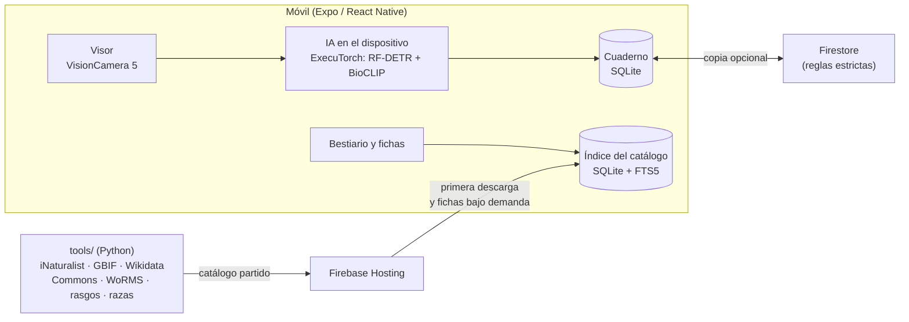

<div align="center">


# Zarpa

**Español** · [English](README.en.md)

Apunta con el móvil a un animal: la IA reconoce la especie **en el propio teléfono**
y tu foto se convierte en un cromo de tu cuaderno de campo.
Más de 266 000 especies de todo el mundo, cada dato con su fuente.

[](https://github.com/Hredo/zarpa/actions/workflows/ci.yml)
[](https://github.com/Hredo/zarpa/releases)
[](LICENSE)
[](#instalación)
[](https://docs.expo.dev/)

**[⬇ Descargar el APK para Android](https://github.com/Hredo/zarpa/releases)**

</div>

---

## Contenido

- [Qué es](#qué-es)
- [Qué hace](#qué-hace)
- [Estado del proyecto](#estado-del-proyecto)
- [**Instalación**](#instalación)
- [Privacidad](#privacidad)
- [Si la app se cierra](#si-la-app-se-cierra)
- [Desarrollo](#desarrollo) — [requisitos](#requisitos) · [puesta en marcha](#puesta-en-marcha) · [comprobaciones](#comprobaciones) · [compilar el APK](#compilar-el-apk) · [catálogo y modelos](#catálogo-y-modelos-tools) · [Firebase](#firebase)
- [Arquitectura](#arquitectura)
- [Cómo decide la IA](#cómo-decide-la-ia)
- [Fuentes de datos y licencias](#fuentes-de-datos-y-licencias)
- [Contribuir](#contribuir)
- [Seguridad](#seguridad)
- [Licencia](#licencia)

---

## Qué es

Zarpa es una app móvil (Android; iOS en preparación) para salir a la calle, al campo o a
la costa y **avistar animales**. Apuntas con la cámara, la IA del móvil dice qué es y, si
lo fichas, su pegatina troquelada se queda en tu cuaderno con la foto, la fecha, el lugar
y el tiempo que hacía.

Tres reglas guían todo el proyecto:

- **Todo el mundo, todas las especies.** El catálogo cubre las especies animales que la
  gente ha fotografiado en libertad en cualquier país, no un subconjunto local.
- **Cada dato, verificado.** Cada dato viene de la autoridad de ese dato o de dos fuentes
  que coinciden. Si no se cumple, la ficha deja el hueco en vez de inventarlo.
- **La IA no finge.** Solo afirma la especie cuando su acierto medido llega al 95 %; si no,
  dice hasta dónde está segura (familia, género…) y te deja elegir.

## Qué hace

| | |
|---|---|
| **Visor con IA** | Reconocimiento en directo en el móvil (sin enviar la foto a ningún servidor), con todos los objetivos y todo el zoom de tu cámara: ultra gran angular, tele y el máximo digital. |
| **Cuaderno de cromos** | Cada avistamiento es una pegatina recortada del fondo, con brillo holográfico en las rarezas. Diario, notas de voz, clima y momento del día. |
| **Bestiario** | Más de 266 000 especies con buscador, filtros (grupo, dieta, hábitat, ciudad, granja, amenaza…) y fichas con fotos libres, sonidos, huellas y láminas, distribución y rasgos. |
| **Razas oficiales** | 8 417 razas de perros (FCI), gatos (FIFe) y ganado (FAO DAD-IS y Ministerio de Agricultura). |
| **Atlas** | Mapa con las observaciones de GBIF, municipios, bosques, parques y espacios protegidos, y lo que hay cerca de ti. |
| **Excursiones y retos** | Modo excursión, calendario de qué ver cada mes, retos semanales, logros, quiz diario y avisos de rarezas cerca. |
| **Social (opcional)** | Cuenta de Google, amigos por código, álbum compartido y copia en la nube del cuaderno. Sin cuenta la app funciona entera. |
| **iNaturalist (opcional)** | Envía tus avistamientos a iNaturalist para que la comunidad los confirme. |

## Estado del proyecto

**Beta.** La versión 0.1.0 es la primera pública.

- **Android 8 o superior, procesador de 64 bits (arm64).** Es donde se prueba la app.
- **iOS 17 o superior:** el código está preparado, pero falta configurar el inicio de sesión
  con Apple y Google y aún no hay versión para instalar.
- El inicio de sesión con Google solo funciona en los APK firmados con una clave registrada
  en el proyecto de Firebase (los de las [Releases](https://github.com/Hredo/zarpa/releases)
  lo están). Lo demás funciona en cualquier compilación.

Lo pendiente está en [Issues](https://github.com/Hredo/zarpa/issues).

## Instalación

### Android

1. En el móvil, abre la [página de Releases](https://github.com/Hredo/zarpa/releases) y
   descarga el `.apk` de la versión más reciente (unos 250 MB: lleva la IA dentro).
2. Ábrelo. Si Android avisa de que no permite instalar apps de origen desconocido, toca
   **Ajustes** y activa **Permitir de esta fuente** para el navegador o el gestor de
   archivos con el que lo abriste.
3. Toca **Instalar**. Si ya tenías una versión anterior, se actualiza sin perder tu cuaderno.
4. Al abrirla por primera vez, la app descarga el índice del catálogo (unos 15-20 MB por la
   red). Después funciona sin conexión, salvo lo que depende de internet: mapas, fotos de
   las fichas que no hayas abierto antes, clima y lo social.

> [!NOTE]
> Los APK de prueba están firmados con una clave de desarrollo. Cuando Zarpa llegue a
> Google Play, habrá que desinstalar esta versión antes de instalar aquella, y el cuaderno
> del móvil se borra al desinstalar. Si entras con tu cuenta, la copia en la nube conserva
> los datos de cada avistamiento (las fotos, de momento, solo están en el móvil).

**Comprobar la descarga:** cada versión publica la huella SHA-256 del APK en sus notas.
En Windows, `certutil -hashfile zarpa.apk SHA256`; en macOS o Linux, `shasum -a 256 zarpa.apk`.

### iOS

Aún no hay versión para instalar. Si quieres probarla en tu iPhone, puedes compilarla tú
(ver [Desarrollo](#desarrollo)) con Xcode y tu cuenta de desarrollador.

## Privacidad

- **La IA corre en el móvil.** Las fotos de los avistamientos no salen del teléfono para
  reconocer al animal.
- **El cuaderno vive en el móvil** (SQLite). La cuenta es opcional; si la usas, la copia en
  la nube guarda los datos de cada avistamiento en Firestore, protegidos por reglas que solo
  dejan a cada persona leer y escribir lo suyo.
- **Lo que la app pide a terceros:** el catálogo (Firebase Hosting), las fotos y sonidos de
  las fichas (Wikimedia Commons e iNaturalist), los mapas (OpenFreeMap y GBIF), el clima
  (Open-Meteo, con la posición del avistamiento) y, solo si lo conectas, iNaturalist.
- **Sin analíticas ni publicidad.** La telemetría de la biblioteca de IA está desactivada.
- La ubicación solo se usa con la app abierta, para saber qué especies viven donde estás y
  apuntar dónde viste cada animal. Los avisos de rarezas nunca muestran dónde se vieron.

## Si la app se cierra

Si Zarpa se cierra por un error, la próxima vez que la abras te enseñará qué falló, con un
botón **Compartir el error**. Ábrelo y adjunta ese texto a un
[informe de fallo](https://github.com/Hredo/zarpa/issues/new?template=fallo.yml): con eso
se puede arreglar sin conectar el móvil a un ordenador. El texto solo lleva el error, la
versión y la fecha: ni fotos, ni ubicación, ni datos de tu cuenta.

---

## Desarrollo

### Requisitos

| Herramienta | Versión | Para qué |
|---|---|---|
| [Node.js](https://nodejs.org/) | 22 | Todo el JavaScript |
| [pnpm](https://pnpm.io/) | 11 | Gestor de paquetes. **El proyecto usa solo pnpm** (nada de npm, npx ni yarn) |
| JDK | 17 o 21 | Compilar Android y los emuladores de Firebase |
| [Android Studio](https://developer.android.com/studio) | reciente | SDK de Android y, si quieres, un móvil virtual |
| Xcode | el que pida Expo SDK 57 | Solo para iOS (macOS) |
| Python + [uv](https://docs.astral.sh/uv/) | 3.13 | Solo para regenerar el catálogo y los modelos (`tools/`) |

Un móvil Android real con la **depuración USB** activada es la mejor forma de probar la
cámara y la IA.

### Puesta en marcha

```bash
git clone https://github.com/Hredo/zarpa.git
cd zarpa/app
pnpm install
```

**1. Configuración (opcional).** Sin ella la app funciona entera, pero sin cuentas ni nube:

```bash
cp .env.example .env
```

Rellénalo con la configuración web de **tu** proyecto de Firebase (ver
[docs/firebase.md](docs/firebase.md)). Son identificadores públicos del cliente, pero el
`.env` no se sube al repositorio.

**2. Modelos de IA.** No van en git (160 MB). Descárgalos de la release a `app/assets/models/`:

```bash
gh release download v0.1.0 --repo Hredo/zarpa --dir assets/models --pattern "bioclip_int8.pte" --pattern "species_index.bin"
```

Sin la CLI de GitHub, descárgalos a mano desde la
[release v0.1.0](https://github.com/Hredo/zarpa/releases/tag/v0.1.0) a esa misma carpeta.
Deben coincidir con el `id` de `app/src/ai/modelAsset.ts`; si regeneras los modelos con
`tools/`, ese fichero se actualiza solo.

| Fichero | SHA-256 |
|---|---|
| `bioclip_int8.pte` | `0bb59260ae040915f7c69ca231c8904f4925dbe5c162f69644f6dc4a018780ce` |
| `species_index.bin` | `894be623d4710eb2982ecf6a6c8280d54fb3ac7e249bb3ce027f7f5eaa7fa4fb` |

**3. Arrancar en un móvil** (compilación de desarrollo: la app usa módulos nativos que Expo
Go no trae):

```bash
pnpm android
```

La primera vez genera la carpeta `android/` (no se versiona: sale de `app.json` y de los
*config plugins*) y compila; tarda varios minutos.

### Comprobaciones

Antes de abrir una PR, las tres tienen que pasar:

```bash
pnpm typecheck
pnpm lint
pnpm test
```

Las pruebas que consultan el catálogo real (búsquedas, razas, retos, quiz) necesitan
`tools/out/indice.db` y `tools/out/catalogo.db`. Si no los has generado, se saltan con un
aviso y el resto se ejecuta igual; la CI hace lo mismo.

Las reglas de Firestore y Storage tienen sus propias pruebas contra los emuladores de
Firebase (necesitan Java):

```bash
cd firebase
pnpm install
pnpm test
```

### Compilar el APK

```bash
cd app
pnpm exec expo prebuild --platform android
cd android
./gradlew assembleRelease --max-workers=4
```

El APK sale en `app/android/app/build/outputs/apk/release/app-release.apk`. Solo se compila
para `arm64-v8a`. Con muchos núcleos, la compilación nativa en paralelo puede agotar la
memoria; `--max-workers=4` lo evita. Si cambias `app.json` o un *config plugin*, añade
`--clean` al `prebuild`.

Sin keystore propio, el APK de release se firma con la clave de depuración de Android. Para
publicar, configura tu keystore y [EAS Build](https://docs.expo.dev/build/introduction/)
(`pnpm dlx eas-cli@latest build`), y registra su SHA-1 en Firebase si usas Google.

### Catálogo y modelos (`tools/`)

El catálogo y los modelos se generan con Python a partir de fuentes abiertas. Todas las
peticiones pasan por una caché HTTP (`tools/cache/http`): repetir una etapa no vuelve a
descargar lo que ya tiene.

```bash
cd tools
uv run python -m zarpa_data universe taxa wikidata gbif countries split commons wikipedia worms traits breeds urban depth size inat_names gbif_names photos wiki_images gbif_media obs_photos rank_names build hosting
```

| Etapa | Qué hace |
|---|---|
| `universe`, `taxa` | Especies con observaciones confirmadas en libertad (iNaturalist) que existen también en la taxonomía de GBIF |
| `wikidata`, `wikipedia`, `commons`, `*_names` | Nombres comunes, resúmenes, fotos libres, huellas y láminas |
| `gbif`, `countries`, `split`, `urban`, `depth` | En qué países se ve cada especie, si vive en ciudades, profundidad (cruzada con WoRMS) |
| `worms`, `traits`, `size` | Medio (marino, agua dulce, tierra), dieta, actividad, reproducción y tamaño |
| `breeds` | Razas reconocidas (FCI, FIFe, FAO DAD-IS, MAPA) |
| `build` | `tools/out/catalogo.db` |
| `hosting` | Parte el catálogo en `tools/out/hosting/` para servirlo desde Firebase Hosting |

La generación completa tarda horas (las APIs públicas tienen límites de ritmo) y ocupa
varios GB de caché. Para el día a día no hace falta: la app descarga el catálogo publicado.

Los modelos (`tools/zarpa_models/`) usan entornos aparte con PyTorch y ExecuTorch:
`export_pte.py` exporta el codificador de imagen de BioCLIP a ExecuTorch (int8),
`build_index.py` crea el índice de especies, `bench.py` y `evaluate.py` calibran los
umbrales y `publish.py` lo copia a `app/assets/models/` y escribe `app/src/ai/modelAsset.ts`.

### Firebase

Zarpa funciona en el **plan gratuito (Spark)**: Authentication, Firestore y Hosting, sin
Cloud Functions. Las reglas (`firestore.rules`, `storage.rules`) son la única defensa y
cada una tiene su prueba. Proyecto, despliegue y modelo de datos: [docs/firebase.md](docs/firebase.md).
Amigos y álbum compartido: [docs/social.md](docs/social.md).

---

## Arquitectura



| Ruta | Qué hay |
|---|---|
| `app/src/app/` | Pantallas (Expo Router: cada fichero es una ruta) |
| `app/src/ai/` | Motor de reconocimiento, umbrales calibrados, elección de cámara y zoom |
| `app/src/db/` | Catálogo (índice local + fichas desde Hosting) y consultas del Bestiario |
| `app/src/lib/` | Captura, pegatinas, ubicación, clima, sonidos, registro de cierres… |
| `app/src/store/`, `app/src/sync/`, `app/src/social/` | Estado, copia en la nube y lo social |
| `app/modules/` | Módulos nativos propios: recorte de pegatinas (ML Kit / Vision) y registro de cierres |
| `app/tests/` | Pruebas con Jest |
| `tools/` | Generación del catálogo (`zarpa_data`) y de los modelos (`zarpa_models`) |
| `firebase/` | Pruebas de reglas y flujos contra los emuladores |
| `docs/` | Documentación de Firebase y de lo social |

## Cómo decide la IA

1. Un **detector** (RF-DETR Nano) encuadra al animal unas 7 veces por segundo.
2. El **codificador de BioCLIP** convierte el recorte en un vector y lo compara con el
   índice de especies, restringido a las que se ven en tu país.
3. Cada nivel (clase, orden, familia, género, especie) solo se afirma si su probabilidad
   supera un umbral calibrado: el punto desde el que, en 3 430 fotos verificadas de 1 167
   especies que el modelo no vio al entrenarse, la cota inferior de Wilson del acierto
   llega al **95 %**.
4. Al fichar, la foto en alta resolución se analiza de nuevo. Si la IA no llega a la
   especie, el avistamiento se guarda como **sin verificar** y eliges tú.

El 95 % es una media mundial: en peces, moluscos, anfibios y otros invertebrados, con menos
fotos de prueba, puede quedarse en el 85-90 % al nombrar el orden, la familia o el género.
La raza no la propone la IA (no alcanza ese nivel de acierto).

## Fuentes de datos y licencias

El **código** de este repositorio es MIT. Los **datos** que la app descarga conservan su
licencia, y la app muestra el autor y la licencia de cada foto, sonido y texto (pantalla
*Fuentes y reglas*).

| Fuente | Qué aporta | Licencia |
|---|---|---|
| [iNaturalist](https://www.inaturalist.org) | Especies observadas, nombres, fotos y sonidos | Fotos y sonidos: solo CC0, CC BY y CC BY-SA (sonidos también CC BY-ND) |
| [GBIF](https://www.gbif.org) | Taxonomía de referencia, países, ciudades, mapas de observaciones | Según el conjunto de datos (CC0, CC BY, CC BY-NC) |
| [Wikidata](https://www.wikidata.org) | Identificadores, nombres, estado de conservación cruzado | CC0 |
| [Wikimedia Commons](https://commons.wikimedia.org) | Fotos, huellas, láminas y grabaciones | Libres, con autor por fichero |
| [Wikipedia](https://es.wikipedia.org) | Resúmenes de las fichas | CC BY-SA 4.0 |
| [WoRMS](https://www.marinespecies.org) | Medio marino, agua dulce o tierra | CC BY 4.0 |
| AVONET, EltonTraits, ReptTraits, AmphiBIO | Dieta, actividad, reproducción, hábitat | Licencias de cada publicación científica |
| FCI, FIFe, [FAO DAD-IS](https://www.fao.org/dad-is), MAPA | Razas reconocidas | Datos públicos de cada organismo |
| [GeoNames](https://www.geonames.org) | Grandes ciudades | CC BY 4.0 |
| © [OpenStreetMap](https://www.openstreetmap.org/copyright), [OpenFreeMap](https://openfreemap.org) | Mapa base, bosques, parques y espacios protegidos | ODbL |
| [Open-Meteo](https://open-meteo.com) | Clima de cada avistamiento | CC BY 4.0 (uso no comercial gratuito) |
| [BioCLIP](https://github.com/Imageomics/bioclip) (Imageomics) | Modelo de reconocimiento de especies | MIT |
| [RF-DETR Nano](https://github.com/software-mansion/react-native-executorch) | Detector de animales | Apache 2.0 |

## Contribuir

Las contribuciones son bienvenidas: fallos, datos que no cuadran, traducciones, mejoras de
la IA o del diseño. Lee [CONTRIBUTING.md](CONTRIBUTING.md) antes de empezar y respeta el
[código de conducta](CODE_OF_CONDUCT.md).

## Seguridad

Si encuentras una vulnerabilidad, **no abras un issue público**: sigue
[SECURITY.md](SECURITY.md) para avisar en privado.

## Licencia

[MIT](LICENSE) © 2026 Hugo Redondo Valdés. Los datos y modelos de terceros mantienen sus
licencias (ver [Fuentes de datos y licencias](#fuentes-de-datos-y-licencias)).
